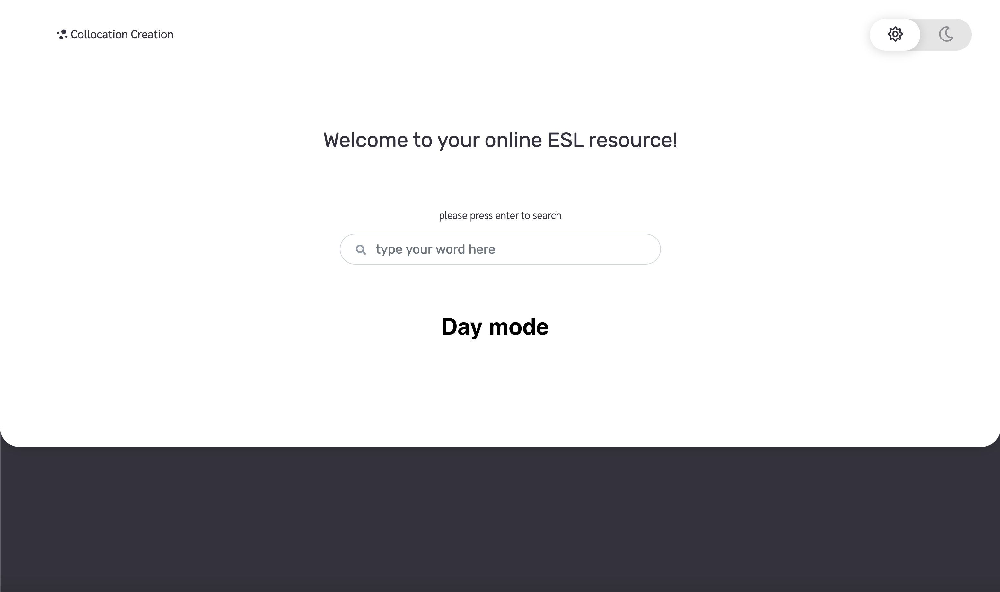
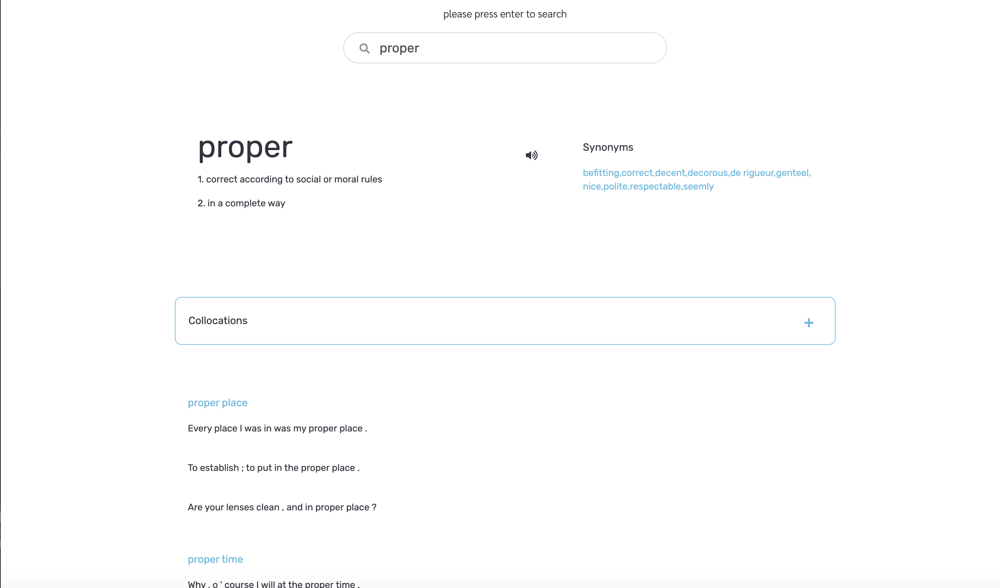
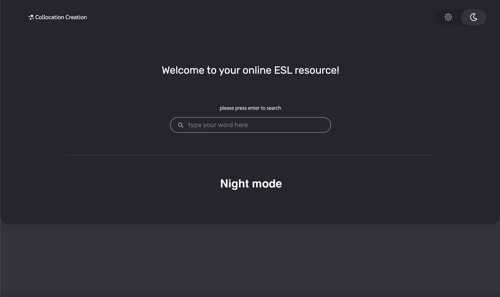

# collocation-creation

## Instructions
	1. Type the word you want to search in the search bar.
	2. Click enter to see your results.
	3. Click the 'Day/Night' toggle to switch from daylight mode to night mode.

## Author and Acknowledgement
Authors:
	• Zach Ledford
	• Haylee McLemore
	• John Pendergrass
	• Christian Shaw

Acknowledgements:
	• Ihab Alizzawi

## APIs used
	1. Merriam Webster Learners Dictionary
	2. Merriam Webster Collegiate Thesaurus
	3. Linguatools English Collocations

## Important links
	- Repository link: https://github.com/Bootcamp-Projects/collocation-creation
	- Github link: https://bootcamp-projects.github.io/collocation-creation/

## Website images

